# Trabajo Práctico 2 — Seminario de Práctica Informática

**Universidad Siglo 21**
Alumno: Martín Alejandro Sánchez Cejas
Legajo: VINF016509
Proyecto: Tribu — plataforma de comunidades con cursos pagos (al estilo Skool)
Repositorio: https://github.com/Martinchos93/TP-2-seminario-de-practico-informatica-martin-sanchez

---

## 1. Análisis del modelo de negocio

### 1.1 La organización y su problema

El proyecto se desarrolla para Tribu, una empresa que ofrece a academias y creadores de contenido
una plataforma donde reunir a su comunidad y venderle cursos, en la línea de productos como Skool.
Sus clientes son academias de formación técnica que hoy trabajan con herramientas sueltas: la
comunidad vive en un grupo de WhatsApp o Discord, los cursos se suben a Google Drive o YouTube, el
cobro se hace por transferencia o con una pasarela independiente y el seguimiento de los alumnos se
lleva en planillas de cálculo.

De ese modo de trabajo se desprenden cuatro problemas concretos:

| Problema | Consecuencia medible |
|---|---|
| La oferta de cursos está dispersa en varias herramientas | Se pierden ventas por falta de descubrimiento |
| El cobro es manual y se concilia a mano | Demora de 24 a 72 h entre el pago y la habilitación del curso |
| El avance del alumno no se registra | No se puede detectar deserción ni emitir constancias |
| Cada academia gestiona sus miembros por separado | Datos duplicados e inconsistentes |

### 1.2 La solución propuesta y su justificación

Tribu es una plataforma web donde cada academia tiene su espacio, publica sus cursos, cobra el
acceso y acompaña el avance de sus alumnos, todo en un mismo lugar. La justificación del proyecto se
apoya en tres puntos:

1. **Reduce el ciclo de cobro a segundos.** La habilitación del curso deja de ser una tarea
   administrativa: queda atada al resultado de la pasarela de pagos dentro de la misma transacción.
2. **Convierte el avance en dato.** Cada lección completada se registra, lo que habilita reportes de
   avance, detección temprana de deserción y emisión automática de certificados.
3. **Unifica la identidad del usuario.** Un alumno tiene una sola cuenta para todas las academias de
   la plataforma, y las academias comparten la infraestructura en lugar de sostener cada una la suya.

### 1.3 Alcance del MVP

Se define como producto mínimo viable el circuito completo que va del catálogo al certificado:

- Registro y autenticación con tres perfiles: `ADMIN`, `ACADEMIA` y `ALUMNO`.
- Alta de academias por parte del administrador.
- Creación y publicación de cursos por parte de las academias.
- Inscripción del alumno y pago del curso.
- Cursado con registro de avance lección por lección.
- Listado y gestión de usuarios para el administrador.
- Emisión automática de certificado al completar el plan de estudio.

Queda fuera de esta entrega: el muro de la comunidad (publicaciones y comentarios), reproducción
de video propia, exámenes calificados, facturación electrónica y aplicación móvil nativa.

### 1.4 Límites del MVP y modelo de clases

Los límites del MVP no son sólo una lista de funciones: determinan qué clases existen en el modelo
del dominio (apartado 3.3). Cada capacidad incluida tiene al menos una clase que la sostiene, y lo que quedó
fuera no tiene clases. Así el diagrama de clases no modela nada que el prototipo no implemente.

| Dentro del MVP | Clases del dominio que lo soportan |
|---|---|
| Usuarios con tres perfiles | `Usuario`, `Rol` |
| Alta de academias | `Academia` (uno a uno con su `Usuario` titular) |
| Creación y publicación de cursos | `Curso`, `Categoria`, `Modulo`, `Leccion`, `EstadoCurso` |
| Inscripción | `Inscripcion`, `EstadoInscripcion` |
| Pago del curso | `Pago`, `EstadoPago`, `MedioPago` |
| Cursado con avance | `ProgresoLeccion` |
| Certificado | `Certificado` |

| Fuera del MVP | Clases que tendría y por qué no están |
|---|---|
| Muro de la comunidad | `Publicacion`, `Comentario`: no hay caso de uso que los use en esta iteración |
| Exámenes calificados | `Evaluacion`, `Respuesta`: el avance se mide por lecciones completadas |
| Suscripción mensual a la comunidad | `Suscripcion`: el MVP cobra por curso, no por período |
| Facturación electrónica | `Factura`: el comprobante lo emite la pasarela de pagos |

---

## 2. Aplicación del Proceso Unificado de Desarrollo

El PUD es iterativo, incremental, dirigido por casos de uso y centrado en la arquitectura. Esta
entrega corresponde a una iteración de la fase de Elaboración que produce un prototipo
operacional. La tabla resume qué disciplina produjo cada artefacto y dónde encontrarlo.

| Disciplina | Artefacto entregado | Apartado |
|---|---|---|
| Requisitos | Diagramas de casos de uso · especificación de requerimientos | 3.1 y 3.2 |
| Análisis | Modelo de clases del dominio · clases de interfaz, control y entidad | 3.3 y 3.5 |
| Diseño | Diagramas de secuencia · diagrama de estados · arquitectura en capas | 4 |
| Implementación | Prototipo Java + MySQL, despliegue con Docker | 5 |
| Pruebas | Plan de pruebas y 33 casos automatizados | 6 |

### 2.1 Trazabilidad

La trazabilidad es el criterio que sostiene la coherencia entre etapas: cada caso de uso se puede
seguir hasta la clase que lo implementa, la tabla que lo persiste y la prueba que lo verifica.

| Caso de uso | Clase de servicio | Tablas | Casos de prueba |
|---|---|---|---|
| CU-01 Registrarse | `UsuarioService.registrarAlumno` | `usuario`, `usuario_rol` | CP-09 a CP-14 |
| CU-02 Gestionar usuarios | `UsuarioService.listar` | `usuario`, `rol` | CP-15, CP-18 |
| CU-10 Dar de alta una academia | `AcademiaService.darDeAlta` | `academia`, `usuario`, `usuario_rol` | CP-23 a CP-27, CP-31, CP-32 |
| CU-11 Crear curso | `CursoService.crear` | `curso`, `modulo`, `leccion` | CP-28 a CP-30, CP-33 |
| CU-03 Publicar curso | `CursoService.publicar` | `curso` | CP-19, CP-28, CP-30 |
| CU-04 Inscribirse | `InscripcionService.inscribir` | `inscripcion` | CP-09, CP-12 |
| CU-05 Pagar | `InscripcionService.pagar` | `pago`, `inscripcion` | CP-01 a CP-04, CP-09, CP-10 |
| CU-06 Cursar | `CursadoService.completarLeccion` | `progreso_leccion` | CP-05 a CP-08, CP-11, CP-14, CP-22 |
| CU-07 Emitir certificado | `CursadoService` (privado) | `certificado` | CP-13 |
| CU-08 Consultar catálogo | `CursoService.catalogo` | `curso`, `categoria` | CP-16 |

---

## 3. Etapa de análisis

### 3.1 Modelo de casos de uso

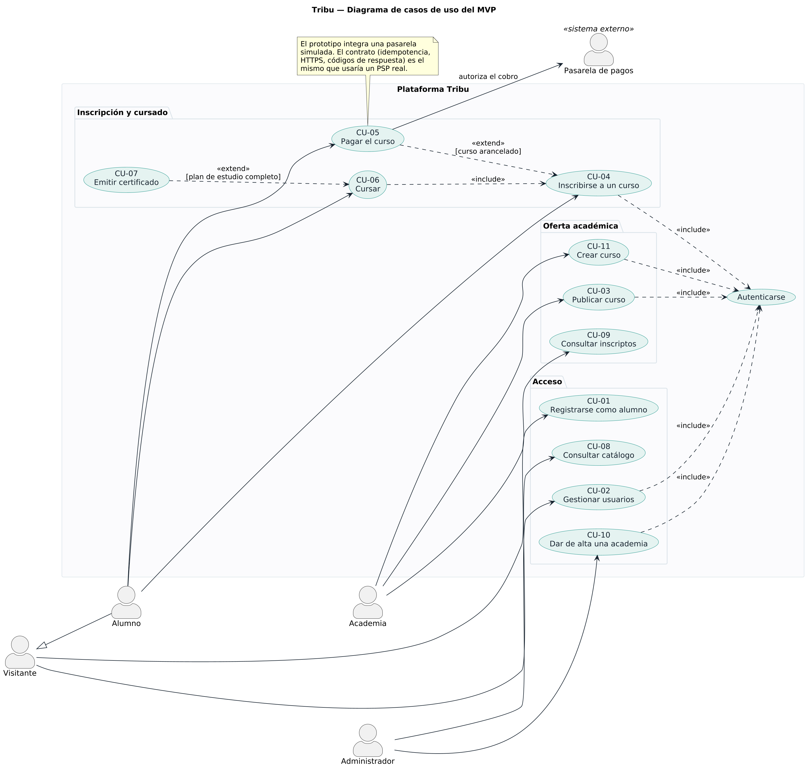

Se identificaron cuatro actores humanos y un sistema externo:

- **Visitante** — navega el catálogo público y puede registrarse.
- **Alumno** — especializa a Visitante; se inscribe, paga y cursa.
- **Academia** — crea y publica cursos, y consulta sus inscriptos.
- **Administrador** — da de alta academias y gestiona las cuentas de toda la plataforma.
- **Pasarela de pagos** — sistema externo que autoriza los cobros.

### 3.2 Especificación de requerimientos

La especificación de requerimientos se basa en Sommerville.

#### 3.2.1 Requerimientos funcionales

| ID | Requerimiento | Prioridad | Caso de uso |
|---|---|---|---|
| RF-01 | El sistema debe permitir registrar una academia junto con la cuenta de su titular. | Alta | CU-10 |
| RF-02 | El sistema debe validar la CUIT de la academia y rechazar las inválidas o ya registradas. | Alta | CU-10 |
| RF-03 | El sistema debe permitir a una academia crear un curso con su plan de estudio. | Alta | CU-11 |
| RF-04 | El sistema debe guardar todo curso nuevo en borrador, fuera del catálogo, hasta que se publique. | Alta | CU-11, CU-03 |
| RF-05 | El sistema debe impedir la publicación de un curso sin lecciones. | Media | CU-03 |
| RF-06 | El sistema debe permitir a un visitante registrarse como alumno. | Alta | CU-01 |
| RF-07 | El sistema debe permitir al alumno inscribirse en un curso publicado. | Alta | CU-04 |
| RF-08 | El sistema debe permitir al alumno pagar el curso con tarjeta. | Alta | CU-05 |
| RF-09 | El sistema debe habilitar el cursado sólo cuando el pago esté aprobado. | Alta | CU-05 |
| RF-10 | El sistema debe impedir que un mismo curso se le cobre dos veces al alumno. | Alta | CU-05 |
| RF-11 | El sistema debe registrar el avance del alumno lección por lección. | Alta | CU-06 |
| RF-12 | El sistema debe emitir un certificado cuando el alumno completa el curso. | Media | CU-07 |
| RF-13 | El sistema debe permitir al administrador listar, filtrar, habilitar y deshabilitar usuarios. | Alta | CU-02 |

Los requerimientos no funcionales se detallan en el apartado 3.4.

#### 3.2.2 RF-01 — Alta de academia

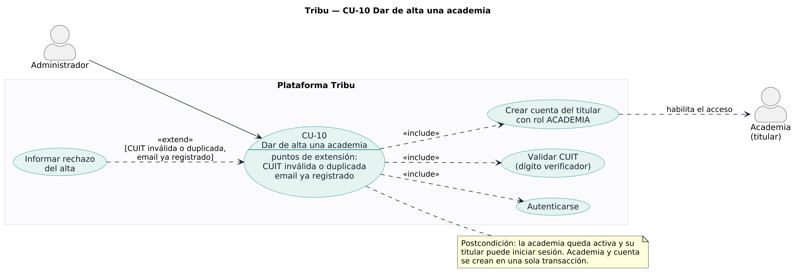

| Campo | Contenido |
|---|---|
| **Función** | Dar de alta una academia |
| **Descripción** | Registra una academia en la plataforma y crea la cuenta de su titular con el rol `ACADEMIA`, para que pueda publicar cursos. |
| **Entradas** | Razón social, CUIT, descripción (opcional); nombre, apellido, email y contraseña inicial del titular. |
| **Fuente** | Formulario *Nueva academia* del panel del administrador. |
| **Salidas** | Academia activa y cuenta del titular habilitada; mensaje de confirmación. |
| **Destino** | Tablas `academia`, `usuario` y `usuario_rol`; listado de usuarios. |
| **Acción** | Valida el formato y el dígito verificador de la CUIT, verifica que ni la CUIT ni el email estén registrados, guarda la contraseña con BCrypt y crea la academia y la cuenta en una sola transacción. |
| **Requiere** | Rol `ACADEMIA` cargado en la base. |
| **Actor** | Administrador. |
| **Precondición** | El administrador inició sesión. |
| **Postcondición** | La academia existe, está activa y su titular puede iniciar sesión. |
| **Efectos colaterales** | Se agrega una cuenta nueva al listado de usuarios. |

**Flujo principal**

1. El administrador abre *Gestión de usuarios* y elige Nueva academia.
2. El sistema muestra el formulario de alta.
3. El administrador carga los datos de la academia y del titular, y confirma.
4. El sistema valida el formato y el dígito verificador de la CUIT.
5. El sistema verifica que la CUIT y el email no estén registrados.
6. El sistema crea la cuenta del titular con el rol `ACADEMIA` y la academia asociada.
7. El sistema vuelve al listado de usuarios e informa el alta.

**Flujos alternativos**

- **3a. Faltan datos obligatorios o el formato es inválido.** El sistema marca cada campo con su
  error y conserva lo cargado. Vuelve al paso 3.
- **4a. El dígito verificador de la CUIT no es correcto.** El sistema informa "La CUIT no es
  válida" y no registra nada. Vuelve al paso 3.
- **5a. La CUIT ya pertenece a otra academia.** El sistema rechaza el alta. Vuelve al paso 3.
- **5b. El email ya tiene una cuenta.** El sistema rechaza el alta: no se crea la cuenta ni la
  academia. Vuelve al paso 3.

#### 3.2.3 RF-03 — Creación de curso

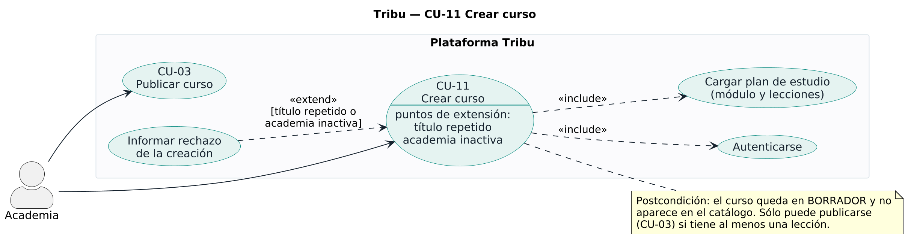

| Campo | Contenido |
|---|---|
| **Función** | Crear curso |
| **Descripción** | Permite a una academia cargar un curso nuevo con su primer módulo y sus lecciones. El curso queda en borrador hasta que la academia lo publica (CU-03). |
| **Entradas** | Título, categoría, descripción, precio en ARS, título del primer módulo (opcional) y lecciones, una por línea (opcional). |
| **Fuente** | Formulario *Nuevo curso* del panel de la academia. |
| **Salidas** | Curso en estado `BORRADOR` con su plan de estudio; mensaje con la cantidad de lecciones creadas. |
| **Destino** | Tablas `curso`, `modulo` y `leccion`; panel *Mis cursos*. |
| **Acción** | Verifica que la academia esté activa, que no tenga otro curso con el mismo título y que el precio no sea negativo; crea el curso con sus módulos y lecciones numerados en orden. |
| **Requiere** | Al menos una categoría cargada. |
| **Actor** | Academia. |
| **Precondición** | El usuario inició sesión con el rol `ACADEMIA` y su academia está activa. |
| **Postcondición** | El curso existe en `BORRADOR` y no aparece en el catálogo público. |
| **Efectos colaterales** | Ninguno sobre el catálogo hasta que el curso se publique. |

**Flujo principal**

1. La academia abre *Mis cursos* y elige Nuevo curso.
2. El sistema muestra el formulario con las categorías disponibles.
3. La academia carga título, categoría, descripción, precio, el primer módulo y sus lecciones, y
   confirma.
4. El sistema valida los datos y verifica que el título no se repita dentro de la academia.
5. El sistema crea el curso en `BORRADOR`, con el módulo y las lecciones en el orden cargado.
6. El sistema vuelve a *Mis cursos*, donde el curso aparece con su cantidad de lecciones y la
   acción Publicar.

**Flujos alternativos**

- **3a. El precio es 0.** El curso se crea como gratuito; al inscribirse, el alumno no pasa por el
  pago (CU-05 no se ejecuta).
- **3b. No se cargan lecciones.** El curso se crea igual, pero el sistema no permite publicarlo
  hasta que tenga contenido (RF-05).
- **4a. Falta un dato obligatorio o el precio es negativo.** El sistema marca el campo con su error.
  Vuelve al paso 3.
- **4b. La academia ya tiene un curso con ese título.** El sistema rechaza la creación. Vuelve al
  paso 3.
- **4c. La academia está inactiva.** El sistema rechaza la creación y el caso de uso termina.

#### 3.2.4 RF-08 — Pago de curso

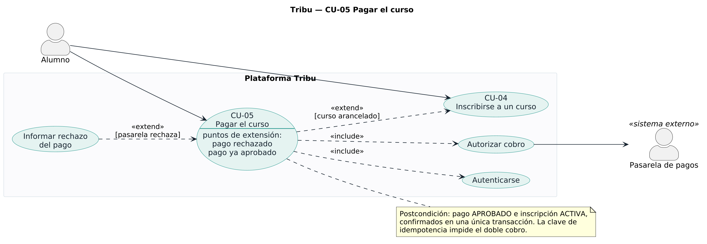

| Campo | Contenido |
|---|---|
| **Función** | Pagar el curso |
| **Descripción** | Cobra el curso a través de la pasarela de pagos y, si el cobro se aprueba, habilita el cursado. |
| **Entradas** | Medio de pago y número de tarjeta. |
| **Fuente** | Pantalla de pago de la inscripción. |
| **Salidas** | Pago `APROBADO` con referencia externa e inscripción `ACTIVA`, o pago `RECHAZADO` con el motivo. |
| **Destino** | Tablas `pago` e `inscripcion`; pantalla de cursado o de pago. |
| **Acción** | Genera una clave de idempotencia, registra el intento, solicita la autorización a la pasarela y, si se aprueba, confirma el pago y activa la inscripción en una única transacción. |
| **Requiere** | Pasarela de pagos disponible. |
| **Actores** | Alumno (principal) y pasarela de pagos (secundario). |
| **Precondición** | Existe una inscripción del alumno en estado `PENDIENTE_PAGO`. |
| **Postcondición** | La inscripción queda `ACTIVA` y tiene un pago `APROBADO` asociado. |
| **Efectos colaterales** | El número de tarjeta no se guarda: en el log sólo quedan los últimos cuatro dígitos. |

**Flujo principal**

1. El alumno abre la pantalla de pago de su inscripción.
2. El sistema muestra curso, academia e importe.
3. El alumno elige el medio de pago, ingresa los datos de la tarjeta y confirma.
4. El sistema genera una clave de idempotencia y registra el pago como `INICIADO`.
5. El sistema solicita la autorización a la pasarela.
6. La pasarela aprueba y devuelve una referencia externa.
7. El sistema marca el pago `APROBADO` y la inscripción `ACTIVA`, en una única transacción.
8. El sistema deriva al alumno a la pantalla de cursado.

**Flujos alternativos**

- **1a. La inscripción no pertenece al alumno autenticado.** El sistema rechaza el acceso y el caso
  de uso termina.
- **4a. La inscripción ya tiene un pago aprobado.** El sistema rechaza la operación sin llamar a la
  pasarela: es la defensa contra el doble cobro (RF-10).
- **6a. La pasarela rechaza el cobro** (fondos insuficientes, tarjeta vencida o número inválido).
  El pago queda `RECHAZADO` con el motivo y la inscripción sigue `PENDIENTE_PAGO`. El intento se
  conserva y se le muestra al alumno, que puede reintentar desde el paso 3.

### 3.3 Modelo de clases del dominio

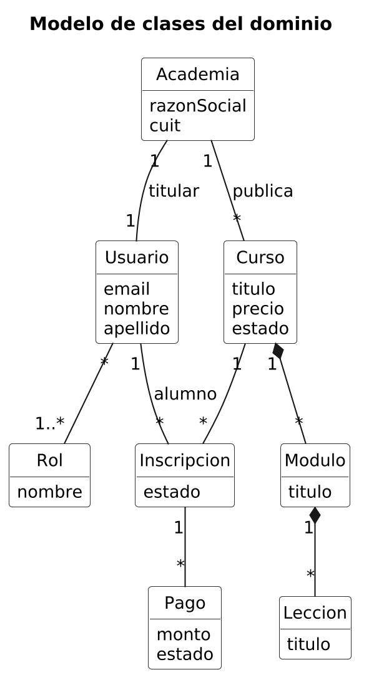

Para armar el modelo partí de los casos de uso y me quedé con los sustantivos que aparecían una y
otra vez: usuario, academia, curso, inscripción, pago. Después agregué `Modulo` y `Leccion`, que
hacían falta para poder cursar.

Como es el modelo de análisis, no puse tipos de datos ni operaciones: eso se decide en el diseño.
Para que se lea fácil dejé solo las clases principales y los atributos que las identifican. Las
clases de apoyo (`Categoria`, `ProgresoLeccion` y `Certificado`) aparecen en el diagrama
entidad-relación del apartado 7.1.

### 3.4 Requisitos no funcionales

| Requisito | Decisión de diseño que lo satisface |
|---|---|
| Las contraseñas no deben ser recuperables | BCrypt con factor de trabajo 10 |
| El importe no admite error de redondeo | Tipo decimal exacto en la base de datos y en Java |
| Un reintento de red no puede cobrar dos veces | Clave de idempotencia única para cada pago |
| El sistema debe levantarse sin instalar dependencias | Docker Compose con build multi-etapa |
| El esquema y el código no pueden divergir | Flyway |

### 3.5 Clases de análisis: interfaz, control y entidad

El PUD propone separar las clases de análisis en tres tipos (Jacobson, Booch y Rumbaugh):

- **Interfaz** (el círculo con una línea a la izquierda): es por donde el actor se comunica con el
  sistema. Para una persona es una pantalla; para otro sistema, como la pasarela de pagos, es la
  conexión con ese sistema.
- **Control** (el círculo con una flecha): coordina el caso de uso. Recibe lo que llega de la
  interfaz, aplica las reglas y decide qué entidades usar.
- **Entidad** (el círculo subrayado): es la información que el sistema guarda, la misma del modelo
  de dominio.

Armé un diagrama por cada caso de uso especificado en el apartado 3.2. La regla que seguí es que el actor
solo habla con una interfaz, la interfaz solo habla con el control, y solo el control toca
las entidades. Así, si mañana cambia una pantalla, no hay que tocar las reglas del negocio.

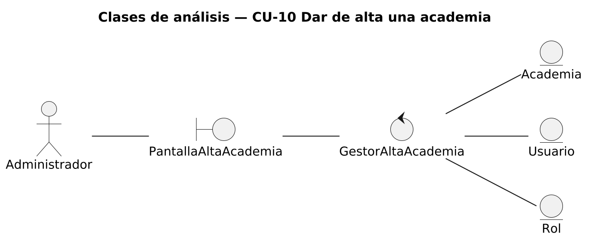

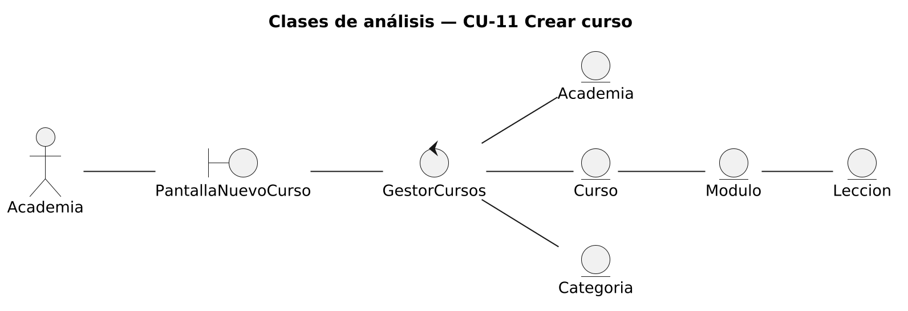

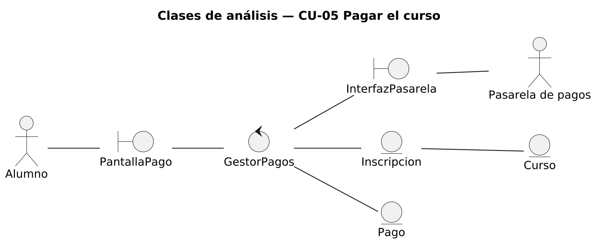

En el pago aparecen dos interfaces: la pantalla que usa el alumno y la conexión con la pasarela
de pagos, que es un actor aunque no sea una persona.

En el diseño cada clase de análisis se convirtió en algo concreto del prototipo:

| Clase de análisis | Tipo | En el diseño |
|---|---|---|
| `PantallaAltaAcademia` | Interfaz | `admin/nueva-academia.html` + `AdminController` |
| `PantallaNuevoCurso` | Interfaz | `academia/nuevo-curso.html` + `AcademiaController` |
| `PantallaPago` | Interfaz | `alumno/pago.html` + `AlumnoController` |
| `InterfazPasarela` | Interfaz | interfaz Java `PasarelaPago` (hoy `PasarelaPagoSimulada`) |
| `GestorAltaAcademia` | Control | `AcademiaService` |
| `GestorCursos` | Control | `CursoService` |
| `GestorPagos` | Control | `InscripcionService` |
| Entidades | Entidad | clases JPA del paquete `domain` y sus tablas |

---

## 4. Etapa de diseño

### 4.1 Arquitectura en capas

El sistema sigue una arquitectura en cuatro capas con dependencias en un solo sentido:

```
Presentación   Controladores + plantillas Thymeleaf    (web/, templates/)
     ↓
Servicio       Reglas de negocio y transacciones       (service/)
     ↓
Persistencia   Repositorios Spring Data JPA            (repository/)
     ↓
Dominio        Entidades y enumerados                  (domain/)
```

### 4.2 Diagramas de secuencia

Cada caso de uso especificado en el apartado 3.2 tiene su diagrama de secuencia. Los tres siguen la
arquitectura en capas del apartado 4.1: el controlador valida el formato de los datos, el servicio aplica las
reglas de negocio dentro de una transacción y la base de datos persiste. Los fragmentos `alt`
corresponden, con la misma numeración, a los flujos alternativos de la especificación.

#### 4.2.1 CU-10 — Dar de alta una academia

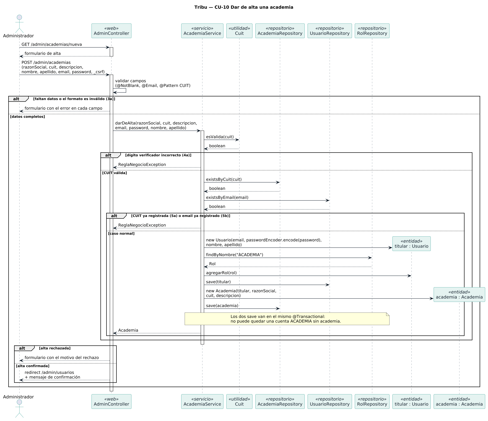

#### 4.2.2 CU-11 — Crear curso

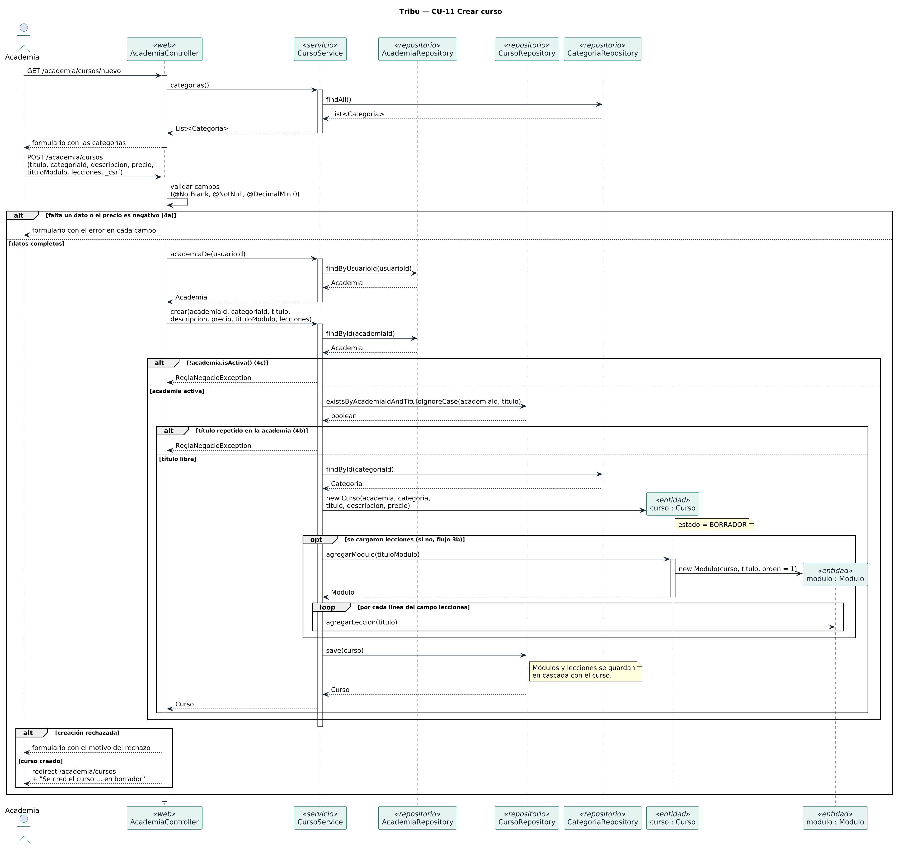

#### 4.2.3 CU-05 — Pagar el curso

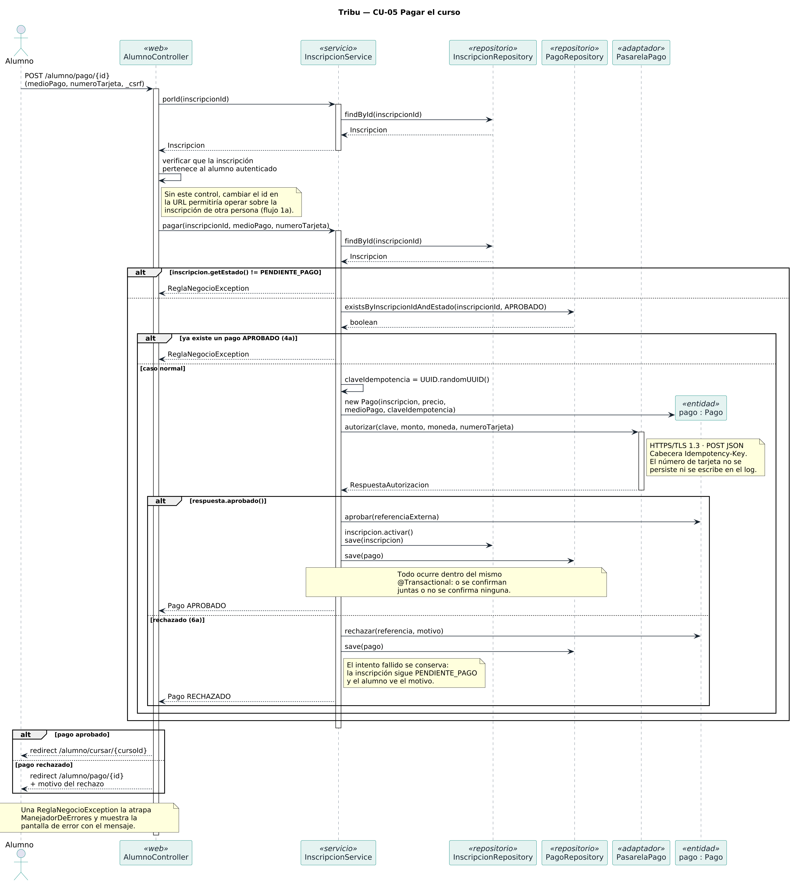

### 4.3 Diagrama de estados — Inscripción

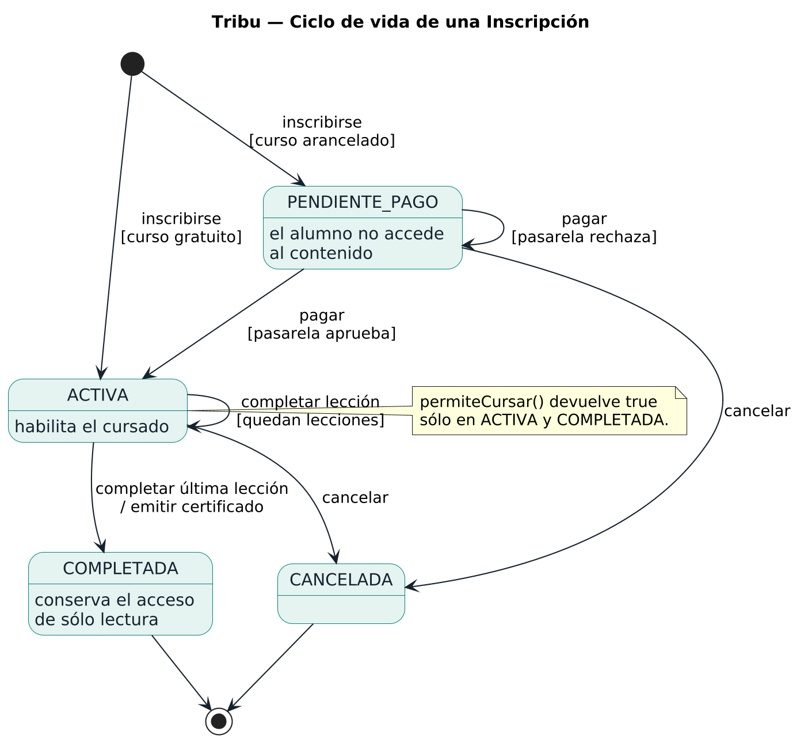

La inscripción es la entidad que gobierna el acceso al contenido, y su ciclo de vida concentra las
reglas del negocio:

- Un curso gratuito genera una inscripción que nace `ACTIVA`; uno arancelado, `PENDIENTE_PAGO`.
- Un pago rechazado no cambia el estado: es una transición reflexiva sobre `PENDIENTE_PAGO`.
- Sólo `ACTIVA` y `COMPLETADA` habilitan el cursado (`permiteCursar()`).

---

## 5. Etapa de implementación

### 5.1 Tecnologías y justificación

| Componente | Elección | Por qué |
|---|---|---|
| Lenguaje | Java 21 (LTS) | Requisito de la consigna; versión con soporte extendido |
| Framework | Spring Boot 3.3 | Estándar de la industria para web + persistencia en Java |
| Vista | Thymeleaf | Renderizado en servidor: menos piezas móviles que un SPA para un MVP |
| Seguridad | Spring Security 6 | Autenticación, autorización por rol y protección CSRF |
| Persistencia | Spring Data JPA (Hibernate) | Mapeo objeto-relacional con consultas declarativas |
| Base de datos | MySQL 8.4 | Requisito de la consigna |
| Migraciones | Flyway | Versiona el esquema; los scripts son el entregable DDL |
| Pruebas | JUnit 5 + Testcontainers | Prueba contra un MySQL real, no contra una base en memoria |
| Despliegue | Docker Compose | Entorno reproducible sin instalar nada |

### 5.2 Cómo ejecutar el prototipo

Requisito único: Docker. No hace falta instalar Java, Maven ni MySQL.

```bash
git clone https://github.com/Martinchos93/TP-2-seminario-de-practico-informatica-martin-sanchez.git
cd TP-2-seminario-de-practico-informatica-martin-sanchez
docker compose up --build
```

La aplicación queda disponible en `http://localhost:8080`.

Cuentas de demostración (contraseña `Tribu2026!` en todas):

| Perfil | Email |
|---|---|
| `ADMIN` | `admin@tribu.com.ar` |
| `ACADEMIA` | `contacto@codeacademy.com.ar` |
| `ALUMNO` | `ana.lopez@gmail.com` · `juan.perez@gmail.com` |

**Tarjetas de prueba de la pasarela simulada:**

| Número | Resultado |
|---|---|
| `4509 9535 6623 3704` | Aprobado |
| `4509 9535 6623 0000` | Rechazado — fondos insuficientes |
| `4509 9535 6623 1111` | Rechazado — tarjeta vencida |

### 5.3 Estructura del proyecto

```
tribu/
├── docker-compose.yml          Orquestación: aplicación + MySQL
├── app/
│   ├── Dockerfile              Build multi-etapa (Maven → JRE)
│   ├── pom.xml
│   └── src/main/
│       ├── java/ar/edu/siglo21/tribu/
│       │   ├── domain/         Entidades JPA y enumerados
│       │   ├── repository/     Repositorios Spring Data
│       │   ├── service/        Reglas de negocio
│       │   ├── web/            Controladores MVC
│       │   ├── dto/            Proyecciones de lectura
│       │   └── config/         Seguridad
│       └── resources/
│           ├── db/migration/   V1 esquema · V2 datos iniciales
│           └── templates/      Vistas Thymeleaf
└── docs/
    ├── uml/                    Diagramas (.puml + .png)
    ├── db/consultas.sql        Consultas SQL del TP
    ├── capturas/               Pantallas del prototipo
    └── informe/                Este documento
```

### 5.4 Pantallas del prototipo

| Catálogo público (CU-08) | Gestión de usuarios (CU-02) |
|---|---|
| 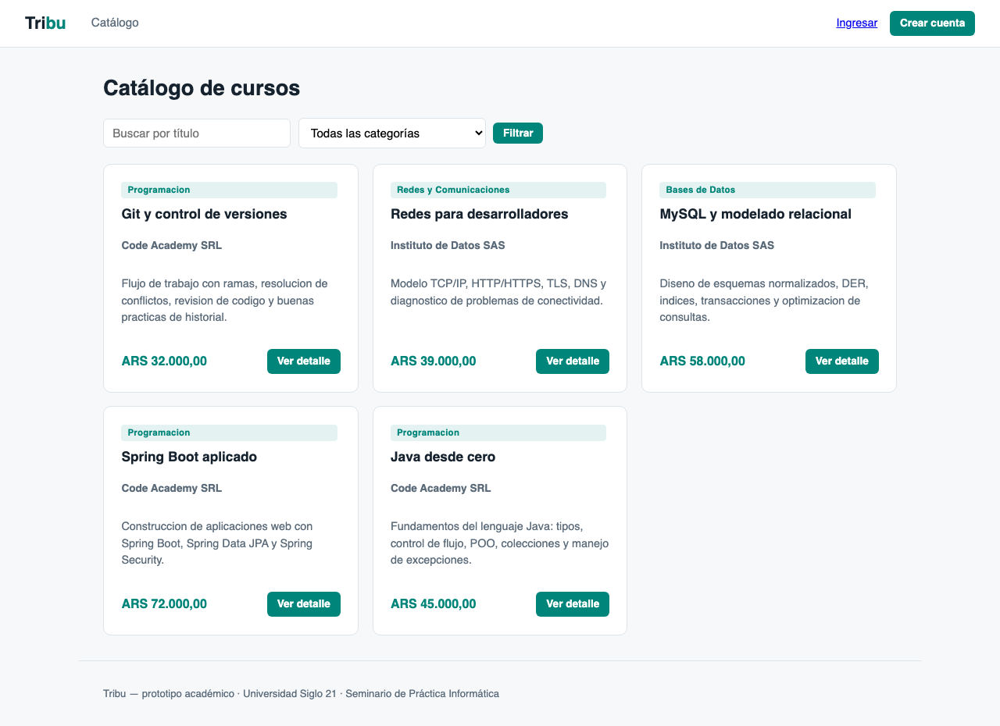 | 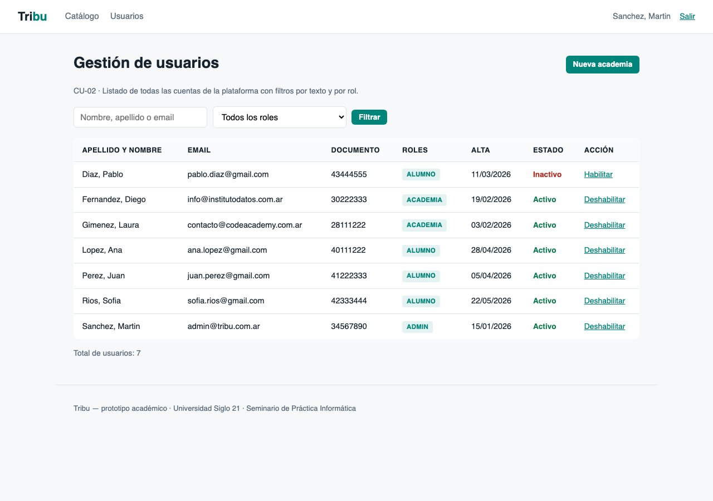 |

| Panel de la academia (CU-03) | Pago del curso (CU-05) |
|---|---|
| 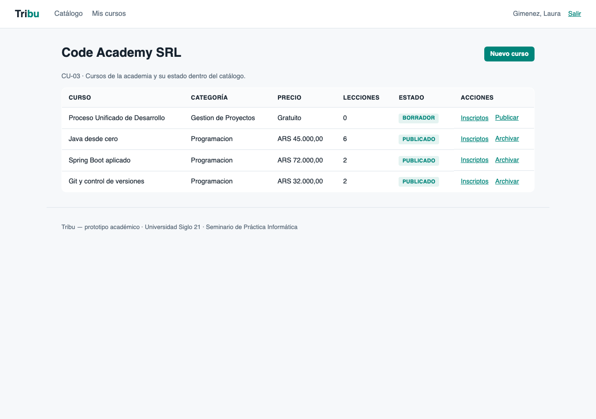 | 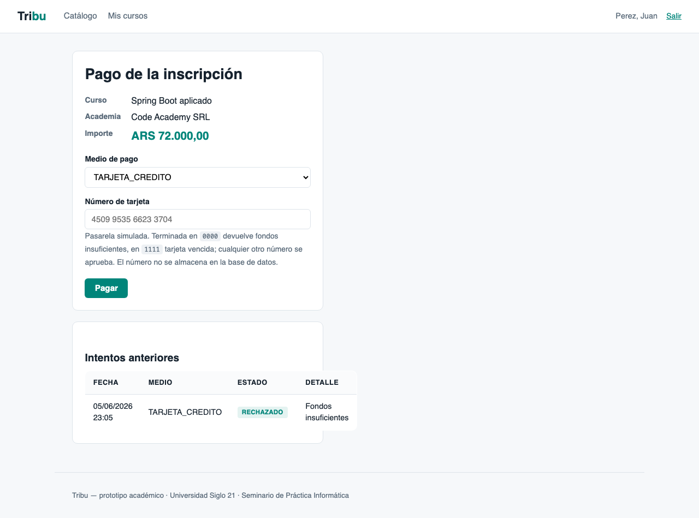 |

| Alta de academia (CU-10) | Creación de curso (CU-11) |
|---|---|
| 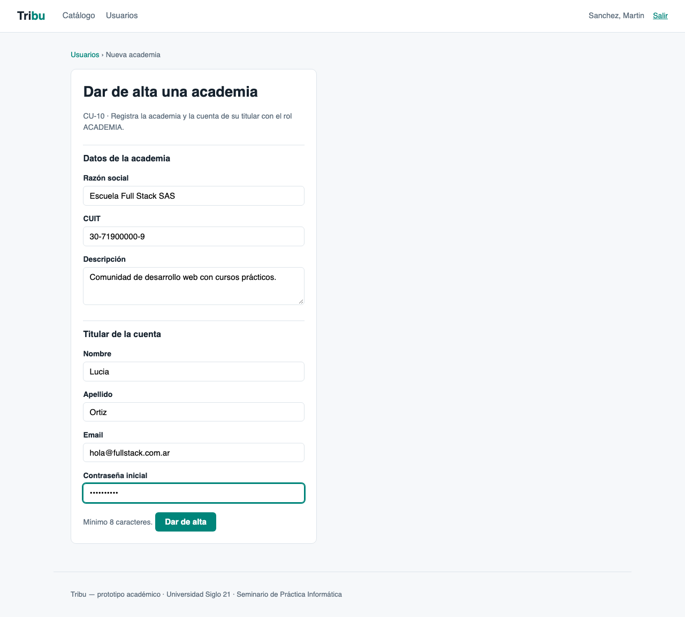 | 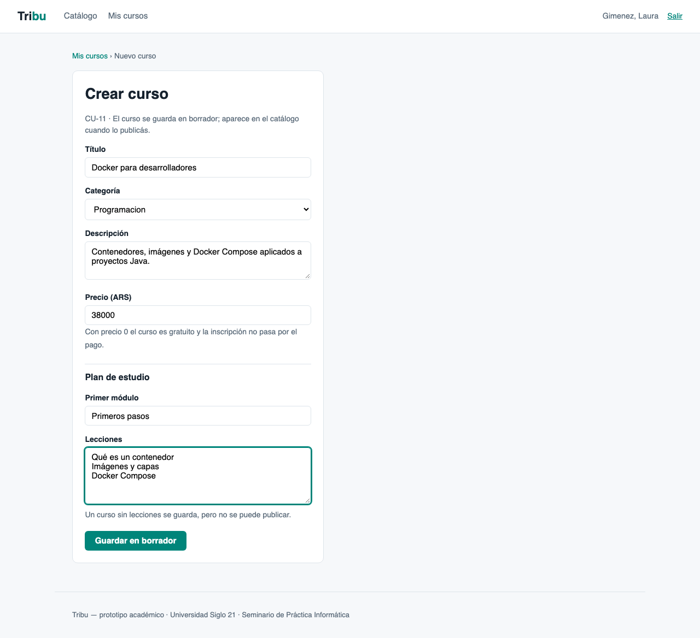 |

| Pago rechazado (CU-05 alt.) | Curso completado y certificado (CU-06 / CU-07) |
|---|---|
| 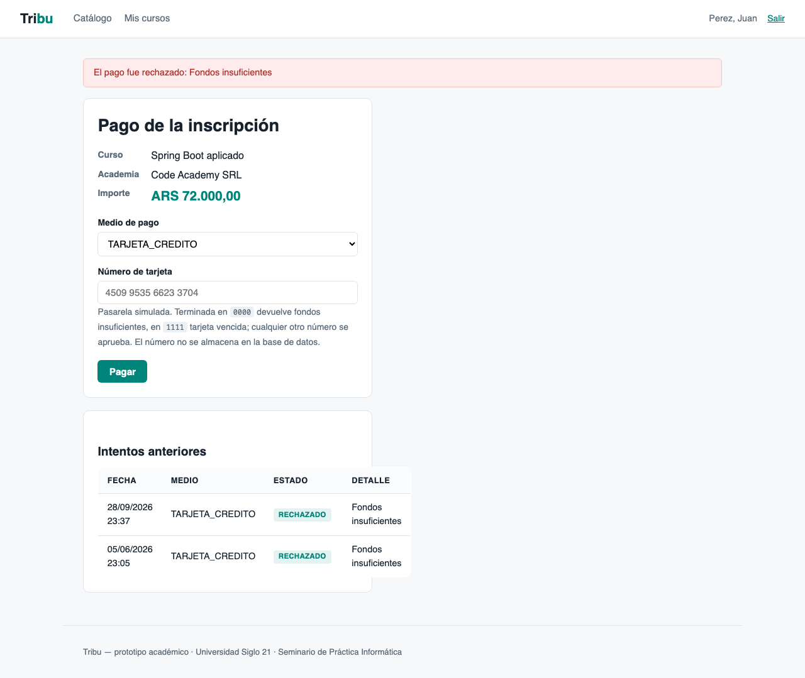 | 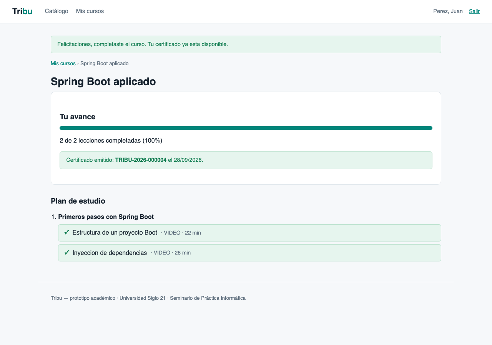 |

### 5.5 Fragmento representativo del código

El método que concentra la regla de negocio del cobro:

```java
@Transactional
public Pago pagar(Long inscripcionId, MedioPago medioPago, String numeroTarjeta) {
    Inscripcion inscripcion = inscripcionRepository.findById(inscripcionId)
            .orElseThrow(() -> new ReglaNegocioException("No existe la inscripcion"));

    if (inscripcion.getEstado() != EstadoInscripcion.PENDIENTE_PAGO) {
        throw new ReglaNegocioException("La inscripcion no esta pendiente de pago");
    }
    if (pagoRepository.existsByInscripcionIdAndEstado(
            inscripcionId, EstadoPago.APROBADO)) {
        throw new ReglaNegocioException(
                "Esta inscripcion ya tiene un pago aprobado");
    }

    String claveIdempotencia = UUID.randomUUID().toString();
    Pago pago = new Pago(inscripcion, inscripcion.getCurso().getPrecio(),
                         medioPago, claveIdempotencia);

    PasarelaPago.RespuestaAutorizacion respuesta = pasarelaPago.autorizar(
            claveIdempotencia, pago.getMonto(), pago.getMoneda(), numeroTarjeta);

    if (respuesta.aprobado()) {
        pago.aprobar(respuesta.referenciaExterna());
        inscripcion.activar();
        inscripcionRepository.save(inscripcion);
    } else {
        pago.rechazar(respuesta.referenciaExterna(), respuesta.motivoRechazo());
    }

    return pagoRepository.save(pago);
}
```

---

## 6. Etapa de pruebas

### 6.1 Estrategia

Se aplicaron tres niveles, cada uno respondiendo una pregunta distinta:

| Nivel | Qué verifica | Herramienta |
|---|---|---|
| **Unitario** | Lógica pura, sin base de datos | JUnit 5 |
| **Integración** | Reglas de negocio contra un MySQL real | Testcontainers |
| **Web** | Que cada pantalla renderice y respete los roles | MockMvc |

La decisión más relevante: las pruebas de integración corren contra MySQL 8.4 real, no contra H2 en
memoria. Una base en memoria habría ocultado los problemas de tipos entre el DDL y las entidades
JPA que efectivamente aparecieron durante el desarrollo (ver apartado 6.3).

El nivel web no es redundante: detecta una familia de errores que las pruebas de servicio no ven —
los que sólo aparecen al construir la vista.

### 6.2 Plan de pruebas

| ID | Caso | Resultado esperado |
|---|---|---|
| CP-01 | Pago con tarjeta válida | Aprobado, con referencia externa |
| CP-02 | Tarjeta terminada en `0000` | Rechazado — fondos insuficientes |
| CP-03 | Tarjeta terminada en `1111` | Rechazado — tarjeta vencida |
| CP-04 | Tarjeta con menos de 13 dígitos | Rechazado sin llegar al cobro |
| CP-05 | Avance 3 de 6 lecciones | 50 %, curso incompleto |
| CP-06 | Avance 6 de 6 | 100 %, curso completo |
| CP-07 | Curso sin lecciones | 0 % sin división por cero |
| CP-08 | Redondeo de 1/3 y 2/3 | 33 % y 67 % |
| CP-09 | Inscripción + pago aprobado | Inscripción `ACTIVA` |
| CP-10 | Inscripción + pago rechazado | Sigue `PENDIENTE_PAGO`, intento registrado |
| CP-11 | Cursar sin haber pagado | Bloqueado con mensaje explicativo |
| CP-12 | Inscribirse dos veces al mismo curso | Rechazado |
| CP-13 | Completar la última lección | `COMPLETADA` + certificado emitido |
| CP-14 | Marcar dos veces la misma lección | No duplica el progreso |
| CP-15 | Listado de usuarios con filtros | Filtra por rol y por texto |
| CP-16 | Catálogo público | Lista sólo cursos `PUBLICADO` |
| CP-17 | Zona privada sin sesión | Redirige a `/login` |
| CP-18 | `ADMIN` en el listado de usuarios | Accede correctamente |
| CP-19 | `ACADEMIA` en su panel | Ve sus cursos y el conteo de lecciones |
| CP-20 | `ACADEMIA` intenta entrar a `/admin` | HTTP 403 |
| CP-21 | `ALUMNO` en sus inscripciones | Ve sus cursos |
| CP-22 | Pantalla de cursado | Muestra plan de estudio y avance |
| CP-23 | CUIT con dígito verificador correcto | Válida |
| CP-24 | CUIT con dígito erróneo o mal formada | Inválida |
| CP-25 | Alta de academia | Academia activa y titular con rol `ACADEMIA` |
| CP-26 | Alta con CUIT inválida o ya registrada | Rechazada, sin crear la cuenta |
| CP-27 | Alta con email ya registrado | Rechazada, sin crear la academia |
| CP-28 | Crear curso y publicarlo | `BORRADOR` fuera del catálogo; tras publicar, visible |
| CP-29 | Crear curso con título repetido en la academia | Rechazado |
| CP-30 | Crear curso sin lecciones y publicarlo | Se crea, pero no se publica |
| CP-31 | `ADMIN` da de alta una academia desde el formulario | Redirige al listado |
| CP-32 | Formulario de alta con CUIT inválida | Muestra el error en pantalla |
| CP-33 | `ACADEMIA` crea un curso desde el formulario | Vuelve a su panel |

**Resultado de la última ejecución:**

```
Tests run: 33, Failures: 0, Errors: 0, Skipped: 0
BUILD SUCCESS
```

### 6.3 Defectos detectados y corregidos

El valor de las pruebas se mide en los defectos que encontraron. Estos tres son reales, surgieron
durante el desarrollo y quedaron corregidos:

| Defecto | Cómo se detectó | Corrección |
|---|---|---|
| Los tipos del DDL no coincidían con las entidades JPA (`SMALLINT UNSIGNED` contra `Integer`) | `ddl-auto=validate` al arrancar el contexto de prueba | Se unificaron los tipos y se eliminó `UNSIGNED`, que no tiene equivalente en Java |
| `MultipleBagFetchException` al cargar módulos y lecciones en una sola consulta | CP-13 y CP-14 | Las colecciones pasaron de `List` a `Set` ordenado con `@OrderBy` |
| `LazyInitializationException` en el panel de la academia al contar lecciones fuera de la transacción | Se detectó probando la aplicación en ejecución; se cubrió con CP-19 | Se reemplazó el recorrido de la colección por una proyección con `GROUP BY` |

El tercero merece un comentario: pasó desapercibido para las pruebas de servicio porque no es un
error de negocio sino de renderizado. Fue lo que motivó agregar el nivel de pruebas web (CP-16 a
CP-22), que hoy cubre ese hueco.

---

## 7. Definición de la base de datos

### 7.1 Diagrama entidad-relación

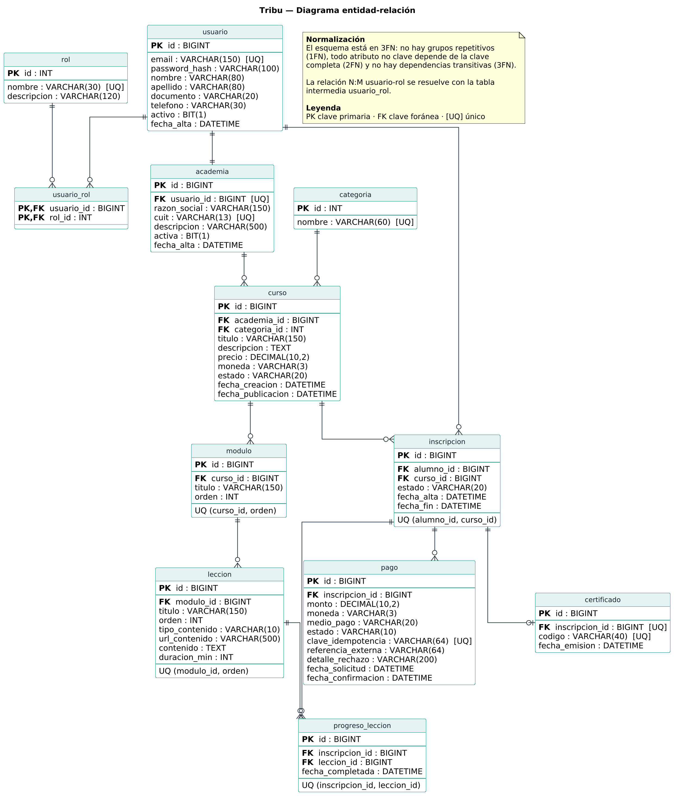

### 7.2 Normalización

El esquema está en tercera forma normal. La justificación, forma por forma:

**1FN — todos los atributos son atómicos y no hay grupos repetitivos.**
El caso que la pone a prueba son los roles: un usuario puede tener varios. Guardarlos como
`"ADMIN,ACADEMIA"` en una columna violaría la 1FN. Se resuelve con la tabla intermedia
`usuario_rol`, cuya clave primaria compuesta `(usuario_id, rol_id)` además impide duplicados.

**2FN — todo atributo no clave depende de la clave completa.**
Las únicas claves compuestas del modelo son las de las tablas asociativas, y no tienen atributos
propios más allá de la clave. Las demás tablas usan clave subrogada simple, por lo que no puede
existir dependencia parcial.

**3FN — no hay dependencias transitivas.**
El caso relevante es el precio. `pago.monto` no es una dependencia transitiva de
`curso.precio`: es el importe histórico efectivamente cobrado. Si mañana el curso cambia de precio,
el pago ya realizado debe conservar el suyo. Por eso se almacena y no se deriva.

Del mismo modo, el nombre de la categoría vive sólo en `categoria`; `curso` guarda la clave foránea.
Duplicar el nombre en `curso` sería una dependencia transitiva y una fuente de inconsistencia.

Desnormalización deliberada: ninguna. En un sistema con este volumen no se justifica.

### 7.3 Integridad y rendimiento

Reglas de negocio sostenidas por la base, no sólo por el código:

| Restricción | Regla que hace cumplir |
|---|---|
| `UNIQUE (alumno_id, curso_id)` en `inscripcion` | Un alumno no se inscribe dos veces al mismo curso |
| `UNIQUE (clave_idempotencia)` en `pago` | Un reintento de red no genera un segundo cobro |
| `UNIQUE (inscripcion_id, leccion_id)` en `progreso_leccion` | Una lección no se cuenta dos veces |
| `UNIQUE (curso_id, orden)` en `modulo` | No hay dos módulos en la misma posición |
| `CHECK (precio >= 0)` | No existen precios negativos |
| `FK ... ON DELETE RESTRICT` hacia `usuario` | No se borra un alumno con historial académico |

La decisión de fondo: validar en la aplicación no alcanza. Dos peticiones concurrentes pueden
pasar la validación de la capa de servicio al mismo tiempo; la restricción `UNIQUE` de la base es la
que garantiza el invariante bajo concurrencia.

Índices definidos en función de las consultas reales del sistema:

| Índice | Consulta que acelera |
|---|---|
| `ix_curso_estado_categoria` | Catálogo filtrado por categoría |
| `ix_inscripcion_curso_estado` | Listado de inscriptos de un curso |
| `ix_pago_inscripcion_estado` | Búsqueda del pago aprobado de una inscripción |
| `ix_usuario_apellido` | Listado del administrador ordenado por apellido |

Las columnas con `UNIQUE` ya tienen índice implícito, de modo que no se duplican.

### 7.4 Creación de las tablas

El DDL completo está en `app/src/main/resources/db/migration/V1__esquema_inicial.sql`. Se ejecuta
automáticamente por Flyway al arrancar la aplicación, de modo que el script del entregable y el
que realmente crea la base son el mismo archivo: no pueden divergir.

Extracto representativo:

```sql
CREATE TABLE inscripcion (
    id          BIGINT      NOT NULL AUTO_INCREMENT,
    alumno_id   BIGINT      NOT NULL,
    curso_id    BIGINT      NOT NULL,
    estado      VARCHAR(20) NOT NULL DEFAULT 'PENDIENTE_PAGO',
    fecha_alta  DATETIME    NOT NULL DEFAULT CURRENT_TIMESTAMP,
    fecha_fin   DATETIME        NULL,
    CONSTRAINT pk_inscripcion PRIMARY KEY (id),
    CONSTRAINT uq_inscripcion_alumno_curso UNIQUE (alumno_id, curso_id),
    CONSTRAINT fk_inscripcion_alumno FOREIGN KEY (alumno_id)
        REFERENCES usuario (id) ON DELETE RESTRICT,
    CONSTRAINT fk_inscripcion_curso FOREIGN KEY (curso_id)
        REFERENCES curso (id) ON DELETE RESTRICT,
    CONSTRAINT ck_inscripcion_estado CHECK (
        estado IN ('PENDIENTE_PAGO', 'ACTIVA', 'COMPLETADA', 'CANCELADA'))
) ENGINE = InnoDB DEFAULT CHARSET = utf8mb4 COLLATE = utf8mb4_0900_ai_ci;
```

Una aclaración sobre los tipos: los atributos de dominio cerrado se declararon `VARCHAR` con
restricción `CHECK` en lugar de `ENUM` de MySQL. `ENUM` es propietario, y su tipo JDBC no se
corresponde con el que espera `@Enumerated(EnumType.STRING)`, lo que hacía fallar la validación del
esquema al arrancar. `VARCHAR` + `CHECK` es SQL estándar y portable.

### 7.5 Consultas SQL

El archivo completo es `docs/db/consultas.sql`. Incluye siete consultas de lectura, la inserción de
un alta completa, tres actualizaciones y cuatro borrados. Se reproducen dos con su salida real.

Avance de cada alumno por curso. La subconsulta `plan` es necesaria: sin ella, el `LEFT JOIN`
con `progreso_leccion` multiplicaría las filas y el conteo total de lecciones saldría inflado.

```sql
SELECT CONCAT(u.apellido, ', ', u.nombre) AS alumno,
       c.titulo                           AS curso,
       i.estado,
       plan.total_lecciones,
       COUNT(pl.id)                       AS lecciones_hechas,
       ROUND(COUNT(pl.id) * 100 / NULLIF(plan.total_lecciones, 0)) AS porcentaje
FROM inscripcion i
         JOIN usuario u ON u.id = i.alumno_id
         JOIN curso   c ON c.id = i.curso_id
         JOIN (SELECT m.curso_id, COUNT(l.id) AS total_lecciones
               FROM modulo m JOIN leccion l ON l.modulo_id = m.id
               GROUP BY m.curso_id) plan ON plan.curso_id = c.id
         LEFT JOIN progreso_leccion pl ON pl.inscripcion_id = i.id
GROUP BY i.id, u.apellido, u.nombre, c.titulo, i.estado, plan.total_lecciones
ORDER BY porcentaje DESC, alumno;
```

```
+-------------+-----------------------------+----------------+-----------------+------------------+------------+
| alumno      | curso                       | estado         | total_lecciones | lecciones_hechas | porcentaje |
+-------------+-----------------------------+----------------+-----------------+------------------+------------+
| Perez, Juan | Java desde cero             | COMPLETADA     |               6 |                6 |        100 |
| Lopez, Ana  | Java desde cero             | ACTIVA         |               6 |                3 |         50 |
| Rios, Sofia | Redes para desarrolladores  | ACTIVA         |               3 |                1 |         33 |
| Lopez, Ana  | MySQL y modelado relacional | ACTIVA         |               2 |                0 |          0 |
| Perez, Juan | Spring Boot aplicado        | PENDIENTE_PAGO |               2 |                0 |          0 |
| Rios, Sofia | Java desde cero             | CANCELADA      |               6 |                0 |          0 |
+-------------+-----------------------------+----------------+-----------------+------------------+------------+
```

Facturación por academia. Sólo suma pagos `APROBADO`: los intentos rechazados no son ingresos.

```sql
SELECT a.razon_social AS academia,
       COUNT(p.id)    AS pagos_aprobados,
       CONCAT('ARS ', FORMAT(SUM(p.monto), 2)) AS total_recaudado
FROM pago p
         JOIN inscripcion i ON i.id = p.inscripcion_id
         JOIN curso       c ON c.id = i.curso_id
         JOIN academia    a ON a.id = c.academia_id
WHERE p.estado = 'APROBADO'
GROUP BY a.id, a.razon_social
ORDER BY SUM(p.monto) DESC;
```

```
+------------------------+-----------------+-----------------+
| academia               | pagos_aprobados | total_recaudado |
+------------------------+-----------------+-----------------+
| Code Academy SRL       |               3 | ARS 135,000.00  |
| Instituto de Datos SAS |               2 | ARS 97,000.00   |
+------------------------+-----------------+-----------------+
```

Borrado con integridad referencial. El sistema practica baja lógica para los usuarios: se
marca `activo = FALSE` y se conserva el historial. El intento de borrado físico es rechazado por la
base:

```sql
DELETE FROM usuario WHERE id = 4;

ERROR 1451 (23000): Cannot delete or update a parent row: a foreign key
constraint fails (`tribu`.`inscripcion`, CONSTRAINT `fk_inscripcion_alumno`
FOREIGN KEY (`alumno_id`) REFERENCES `usuario` (`id`))
```

Ese error no es una falla: es el comportamiento buscado. La restricción `ON DELETE RESTRICT`
impide destruir el historial académico y de pagos de un alumno.

---

## 8. Definiciones de comunicación

### 8.1 Vista de despliegue

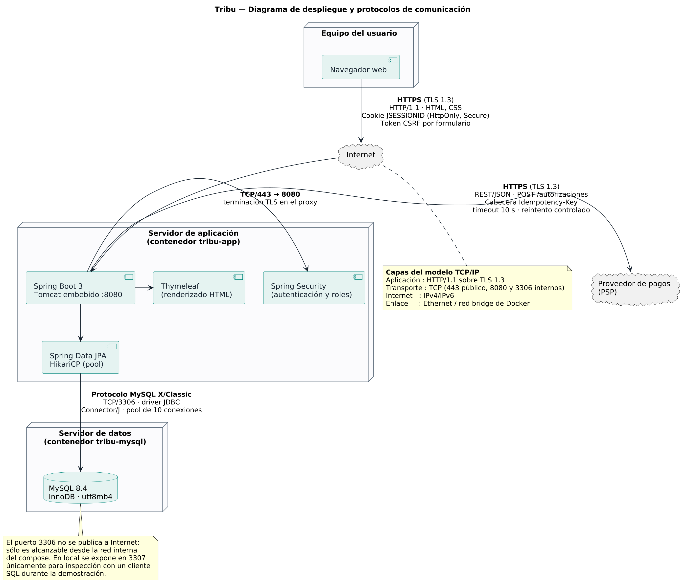

### 8.2 Protocolos por capa del modelo TCP/IP

| Capa | Protocolo | Uso en el sistema |
|---|---|---|
| Aplicación | HTTP/1.1 sobre TLS 1.3 | Entre el navegador y el servidor, y entre el servidor y la pasarela de pagos |
| Transporte | TCP | 443 público; 8080 y 3306 internos |
| Internet | IPv4 / IPv6 | Enrutamiento |
| Enlace | Ethernet / red bridge de Docker | Comunicación entre contenedores |

### 8.3 Comunicación entre el navegador y el servidor

- **Transporte:** HTTPS con TLS 1.3. En producción, la terminación TLS ocurre en un proxy inverso
  delante de la aplicación.
- **Sesión:** cookie `JSESSIONID` con los atributos `HttpOnly` (inaccesible desde JavaScript),
  `Secure` (sólo viaja cifrada) y `SameSite=Lax`.
- **Protección CSRF:** Spring Security genera un token por sesión que Thymeleaf inserta en cada
  formulario. Una petición `POST` sin token válido se rechaza. No se desactivó esta protección.
- **Formato:** HTML renderizado en el servidor. No hay API pública en esta iteración; reducir la
  superficie expuesta es una decisión deliberada para un MVP.

### 8.4 Comunicación entre la aplicación y la base de datos

- **Protocolo:** protocolo nativo de MySQL sobre TCP/3306, mediante el driver JDBC Connector/J.
- **Pool de conexiones:** HikariCP, máximo 10 conexiones, timeout de 10 s. El pool evita el costo de
  abrir una conexión TCP por cada petición HTTP.
- **Aislamiento de red:** el puerto 3306 no se publica a Internet. Sólo es alcanzable desde la
  red interna del `docker-compose`. En desarrollo se expone en el 3307 del host únicamente para
  poder inspeccionar la base con un cliente SQL.
- **Codificación:** `utf8mb4` de extremo a extremo, para soportar correctamente acentos y caracteres
  fuera del plano básico.

### 8.5 Comunicación entre la aplicación y la pasarela de pagos

Es la integración externa del sistema y la que exige más cuidado:

| Aspecto | Definición |
|---|---|
| Protocolo | HTTPS (TLS 1.3), REST sobre JSON |
| Operación | `POST /autorizaciones` |
| Autenticación | Clave de API en cabecera, nunca en la URL |
| **Idempotencia** | Cabecera `Idempotency-Key` con un UUID por intento |
| Timeout | 10 s |
| Reintentos | Sólo ante error de red, reutilizando la misma clave |
| Datos sensibles | El número de tarjeta no se persiste ni se escribe completo en el log: sólo los últimos cuatro dígitos |

Por qué la idempotencia es el punto crítico. Si la aplicación envía la solicitud de cobro y la
respuesta se pierde por un corte de red, la aplicación no puede distinguir entre «el cobro no se
hizo» y «el cobro se hizo pero no me enteré». Reintentar sin más cobraría dos veces. La clave de
idempotencia resuelve exactamente eso: al reintentar con la misma clave, el proveedor devuelve el
resultado de la operación original en lugar de crear una nueva. La restricción `UNIQUE` sobre
`pago.clave_idempotencia` sostiene el mismo invariante del lado del sistema.

### 8.6 Evolución prevista

| Necesidad futura | Mecanismo |
|---|---|
| Confirmación asincrónica de pagos (transferencias) | Webhook firmado desde el PSP hacia la plataforma |
| Aplicación móvil | API REST/JSON con autenticación por token JWT |
| Notificaciones al alumno | SMTP sobre TLS para correo transaccional |
| Entrega de video | CDN con URLs firmadas de vigencia limitada |

---

## 9. Conclusiones

El trabajo permitió recorrer un ciclo completo del Proceso Unificado sobre un caso concreto, desde
el análisis del modelo de negocio hasta un prototipo operacional verificado.

Tres aprendizajes que dejó el desarrollo:

1. **La trazabilidad no es documentación: es una herramienta de verificación.** Poder seguir cada
   caso de uso hasta la prueba que lo cubre fue lo que permitió detectar que el panel de la academia
   no tenía cobertura — y ahí estaba uno de los tres defectos encontrados.

2. **Las restricciones pertenecen a la base de datos, no sólo al código.** La validación en la capa
   de servicio es necesaria para dar un buen mensaje al usuario, pero no sobrevive a la
   concurrencia. El `UNIQUE` sobre `(alumno_id, curso_id)` sí.

3. **Probar contra la base real cambia lo que se encuentra.** Los tres defectos del apartado 6.3 son de
   integración entre capas; ninguno habría aparecido con una base en memoria o con dobles de prueba.

El prototipo no es el sistema completo: es una codificación acotada de algunos casos de uso, los
que hacen falta para recorrer el circuito principal de la plataforma. Los casos de uso codificados
son:

- CU-01 Registrarse como alumno.
- CU-02 Gestionar usuarios.
- CU-03 Publicar curso.
- CU-04 Inscribirse a un curso.
- CU-05 Pagar el curso.
- CU-06 Cursar.
- CU-08 Consultar catálogo.
- CU-09 Consultar inscriptos.
- CU-10 Dar de alta una academia.
- CU-11 Crear curso.

Con estos casos se puede hacer el recorrido completo: una academia se da de alta, crea y publica un
curso, un alumno lo encuentra en el catálogo, se inscribe, lo paga y lo cursa. Lo que queda afuera, como el muro de la comunidad o los exámenes, se deja para las
próximas iteraciones.

---

## 10. Referencias

Jacobson, I., Booch, G. y Rumbaugh, J. El proceso unificado de desarrollo de software. 1.ª edición.

Sommerville, I. Ingeniería de software. 9.ª edición.
